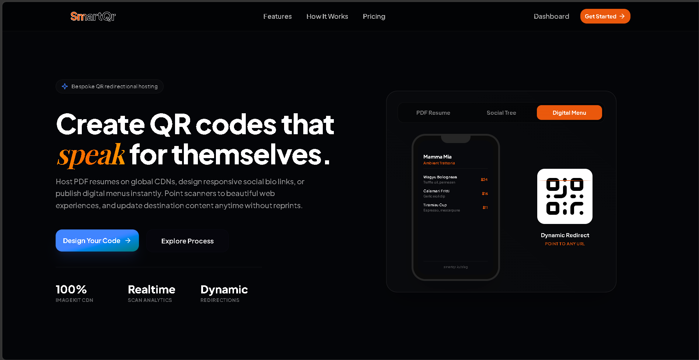

# SmartQR — Premium Dynamic QR Code Redirection Platform

A high-performance Next.js SaaS application for creating, customizing, and hosting dynamic QR codes with real-time tracking, custom formats, and an editorial dark UI.



## 🎯 Features

### 🌟 Redesigned Editorial UI & Brand Ambiance
- **Premium Styling**: Refined with deep dark theme backgrounds, custom grid patterns, and elegant typography (Plus Jakarta Sans paired with Playfair Display display-italic headings).
- **Warm Copper Accents**: Styled with unified copper indicators (`#ea580c`), glowing highlights, and micro-interactions.
- **Custom Branding Icon**: Replaced default assets with a custom vector favicon design: a dark card containing a stylized geometric QR Code finder pattern in a warm copper-to-amber gradient.

### 📋 Dynamic Blueprint Templates
- **PDF Resume File Sharing**: Upload resumes or document assets directly to a global ImageKit CDN. Scanners view an optimized presentation card with embedded inline viewing and instant PDF downloads.
- **Social Bio Trees**: Aggregate LinkedIn, GitHub, Twitter, and website portfolio links into a beautiful unified mobile bio tree page with customizable initials-based avatars.
- **Digital Menus & Catalogs**: Build instant mobile-friendly dining menus and product directories with custom prices, categories, and currency formatting.

### 🔒 Usage Limits & Smart Inline Auth Modal
- **Anonymous Usage Tracking**: Restricts unregistered visitors to a threshold of **3 free actions** (downloads or copies to clipboard).
- **Glassmorphic Auth Prompt**: Exceeding the limits or choosing to save a QR code to the cloud triggers a premium modal with inline sign-in/sign-up forms.
- **Smooth Recovery Flow**: Successfully logging in/registering automatically triggers the pending download or save action without losing form inputs.

### 📊 Real-Time Analytics Dashboard
- **Bento Stats Layout**: Beautiful glass-card metrics for Total Active QRs, Combined Scan Counts, and Top Performing templates.
- **Advanced Management Grid**: Filters by type, search bar with focus ring accents, and quick actions (Copy Link, View/Redirect, Analytics, Delete).
- **Dynamic Chart Tracking**: Follow scan activity over time with clear visual charts.

## 📋 Prerequisites

- **Node.js** 18+ ([Download](https://nodejs.org))
- **npm** or **pnpm** (comes with Node.js)
- **Supabase Account** ([Create free account](https://supabase.com))

## 🚀 Quick Start

### 1. Installation

```bash
# Clone or navigate to the project directory
cd smart-qr-saa-s-web-app

# Install dependencies
npm install
# OR
pnpm install
```

### 2. Supabase Setup

1. **Create a Supabase Project**:
   - Go to [supabase.com](https://supabase.com)
   - Click "Start your project"
   - Create a new project

2. **Get Your Credentials**:
   - Go to Project Settings → API
   - Copy these values:
     - **Project URL** → `NEXT_PUBLIC_SUPABASE_URL`
     - **Anon Public Key** → `NEXT_PUBLIC_SUPABASE_ANON_KEY`

3. **Create Database Tables**:
   - In Supabase, go to SQL Editor
   - Click "New Query"
   - Copy and paste the SQL from `SETUP.md` → Database Tables section
   - Click "Run"

### 3. Environment Configuration

Create a `.env.local` file in the root directory:

```env
NEXT_PUBLIC_SUPABASE_URL=https://your-project.supabase.co
NEXT_PUBLIC_SUPABASE_ANON_KEY=your-anon-key-here
NEXT_PUBLIC_APP_URL=http://localhost:3000
```

### 4. Run Development Server

```bash
npm run dev
# OR
pnpm dev
```

Open [http://localhost:3000](http://localhost:3000) in your browser.

## 🏗️ Project Structure

```
smart-qr-saa-s-web-app/
├── app/
│   ├── page.tsx                    # Home/landing page
│   ├── layout.tsx                  # Root layout
│   ├── globals.css                 # Global styles
│   ├── api/
│   │   └── qr-codes/              # QR code API routes
│   │       ├── route.ts            # GET (list) and POST (create)
│   │       └── [id]/
│   │           └── route.ts        # GET, PUT, DELETE
│   ├── auth/
│   │   ├── login/                  # Login page
│   │   ├── sign-up/                # Sign up page
│   │   ├── callback/               # OAuth callback
│   │   └── error/                  # Error page
│   ├── dashboard/                  # User dashboard
│   ├── generator/                  # QR code generator
│   └── qr/
│       └── [slug]/                 # Public QR redirect
├── components/
│   ├── ui/                         # Reusable UI components
│   ├── dashboard-client.tsx        # Dashboard component
│   ├── qr-generator.tsx            # QR generator component
│   ├── qr-customizer.tsx           # Customization options
│   ├── qr-input.tsx                # Input form
│   └── theme-provider.tsx          # Theme setup
├── lib/
│   ├── supabase/
│   │   ├── client.ts               # Client-side Supabase
│   │   ├── server.ts               # Server-side Supabase
│   │   └── proxy.ts                # Middleware proxy
│   ├── qr-utils.ts                 # QR code utilities
│   └── utils.ts                    # General utilities
├── middleware.ts                   # Next.js middleware
├── next.config.mjs                 # Next.js config
├── tsconfig.json                   # TypeScript config
├── tailwind.config.ts              # Tailwind CSS config
├── postcss.config.mjs              # PostCSS config
├── package.json                    # Dependencies
└── SETUP.md                        # Detailed setup guide
```

## 📱 Pages & Routes

### Public Pages
- `/` - Landing page with features and pricing
- `/auth/login` - User login
- `/auth/sign-up` - User registration
- `/auth/callback` - OAuth callback
- `/qr/[slug]` - Public QR code redirect

### Protected Pages (Requires Login)
- `/dashboard` - User dashboard with QR code management
- `/generator` - QR code generator
- `/dashboard/qr/[id]` - QR code details and analytics

## 🔧 API Endpoints

All API endpoints require authentication.

### QR Codes
- `GET /api/qr-codes` - List user's QR codes
- `POST /api/qr-codes` - Create new QR code
- `GET /api/qr-codes/[id]` - Get QR code details with analytics
- `PUT /api/qr-codes/[id]` - Update QR code
- `DELETE /api/qr-codes/[id]` - Delete QR code

## 🎨 Customization

### Colors
Change default colors in component files:
- **Primary Color**: `#ea580c` (Warm Copper / Orange)
- **Secondary Accent**: `#fb923c` (Amber / Light Orange)
- **Background**: `#040508` (Editorial deep near-black)

### Tailwind CSS
Customize styling in `tailwind.config.ts`

### UI Components
All UI components are in `components/ui/` built with Radix UI and Tailwind CSS

## 🔐 Security

- **Row Level Security (RLS)**: Database-level access control
- **Authentication**: Supabase Auth with email/password
- **CORS**: Configured for Next.js
- **Environment Variables**: Sensitive data in `.env.local`

## 📊 Database Schema

### qr_codes Table
```sql
{
  id: UUID (Primary Key)
  user_id: UUID (Foreign Key to auth.users)
  title: TEXT
  slug: TEXT (Unique)
  qr_type: TEXT
  qr_data: TEXT
  destination_url: TEXT
  custom_color: TEXT
  background_color: TEXT
  size: INTEGER
  error_level: TEXT
  logo_url: TEXT
  scan_count: INTEGER
  created_at: TIMESTAMP
  updated_at: TIMESTAMP
}
```

### qr_analytics Table
```sql
{
  id: UUID (Primary Key)
  qr_code_id: UUID (Foreign Key)
  user_agent: TEXT
  ip_address: TEXT
  country: TEXT
  city: TEXT
  referer: TEXT
  scanned_at: TIMESTAMP
}
```

## 🚀 Building for Production

```bash
# Build the application
npm run build

# Start production server
npm run start
```

## 🐛 Troubleshooting

### "Environment variables not found"
- Ensure `.env.local` exists in the root directory
- Restart the development server after adding variables
- Check that variable names match exactly

### "Cannot find table 'qr_codes'"
- Run the SQL setup from `SETUP.md` in Supabase SQL Editor
- Verify the tables appear in Supabase → Table Editor

### "Unauthorized - 401"
- Clear browser cookies (DevTools → Application → Cookies)
- Log out and log back in
- Check that Supabase URL and keys are correct

### "QR codes not loading in dashboard"
- Open browser console (F12) and check for errors
- Verify API route is accessible: `/api/qr-codes`
- Check Supabase RLS policies are enabled

### "Cannot POST to /api/qr-codes"
- Ensure user is authenticated
- Check request body includes required fields: `title`, `qr_type`, `qr_data`
- Verify database tables exist and RLS is configured

## 📚 Resources

- **Supabase Docs**: https://supabase.com/docs
- **Next.js Docs**: https://nextjs.org/docs
- **Tailwind CSS**: https://tailwindcss.com
- **Radix UI**: https://www.radix-ui.com
- **QR Code Library**: https://github.com/davidshimjs/qrcodejs

## 📝 License

MIT License - Feel free to use this project for personal or commercial purposes.

## 🤝 Contributing

Contributions are welcome! Please feel free to submit a Pull Request.

---

**Made with ❤️ using Next.js, Supabase, and Tailwind CSS**
